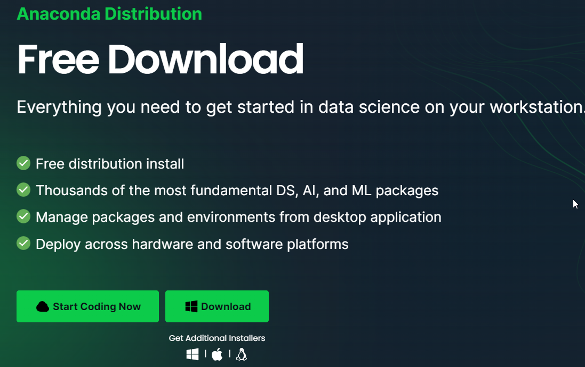
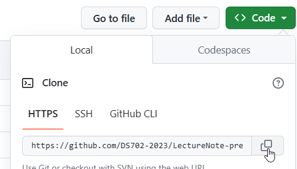
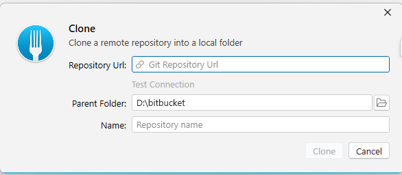
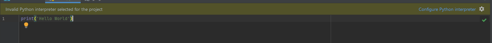
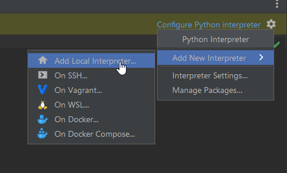
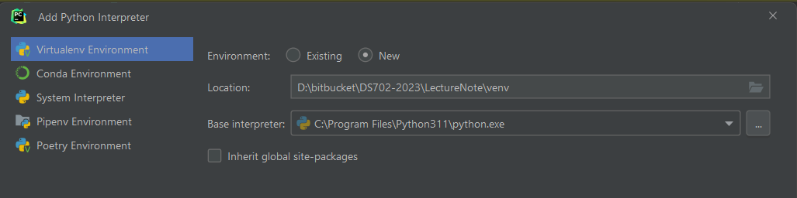
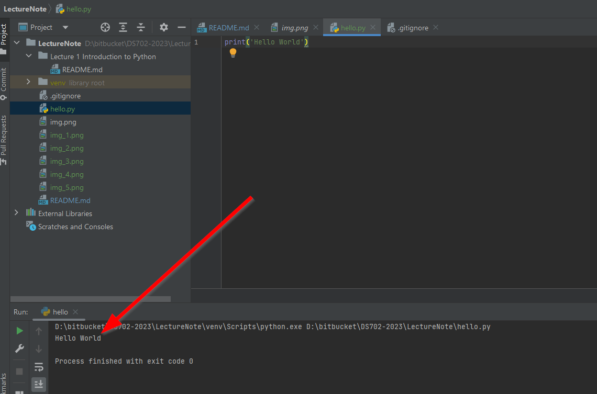

# Introduction to DataScience Programming

## Computer Preparation
In order to start our Data science programming. 
We can provide our computer to get run
- [ ] Install Python run time, and Data science package

    The one of the easiest way is to install Conda,
    install the Conda from the given link [here](https://www.anaconda.com/download).

- [ ] To follow the code conduct in the course, 
please sign up the [GitHub](https://github.com/) to get the code repository  and other benefit. 
using your @cmu.ac.th email
- [ ] please register your email after you have register GitHub [here](https://forms.gle/P7MBZVDhZcS6aC1QA)
- [ ] After you have signed in for the GitHub, please register to [GitHub Student Developer Pack](https://education.github.com/pack) 
to get the benefit of the students.
- [ ] The tools which we are going to use is PyCharm which is the IDE tools for Pythons. We can use the Professional Edition as we are students.
Login to the [ get the student account](https://www.jetbrains.com/lp/leaflets-gdc/students/) for PyCharms
- [ ] Download [Pycharm](https://www.jetbrains.com/pycharm/) to your own computer. Then install, once you start the Pycharm, please 
log in with the email account you have installed from the previous steps

## Using Git
The course material is provided in the Git Repository. You should fork the project in order that
you can manage your work and still getting the new resources. Please follow the giving steps
to prepare your work space.
- [ ] Download Fork which is the GUI git tools. (You may use something else if you are already familiar with Git). 
Install Fork to your computer
- [ ] Open the link [here](https://github.com/DS702-2023/LectureNote). Click Fork, and the source code is copy to your GitHub account.
- [ ] Open your GitHub account, click on Code, copy the HTTPS values as shown in the picture

- [ ] Open Fork, Select `File`->`Clone...` then paste the URLs you have copied and select the destination. 
Then the source code will be on your computer 


## Start Your Python Hello World
- [ ] open your Pycharm, Open  `File`->`Open...` then select the location of the code you have download from your GitHub repository
- [ ] On the root folder create the file hello.py. Then type the given content

  ```python
  print('hello world')
  ```

  then you may see the warning in the IDE

Click Configure the IDE, then select the given choice.



  and then 

  then click OK. After a while you will notice that in the root directory there is the venv folder has been created.

  Then click run. You should see the run result here.


Now This is the end of the lab preparation.


 
